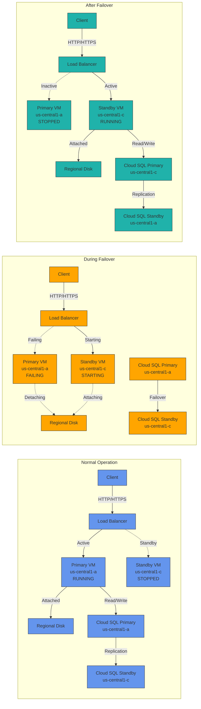

# GCP Disaster Recovery Demo

This project demonstrates a comprehensive disaster recovery (DR) solution using Google Cloud Platform's native services for an active-passive zonal architecture.

## Project Structure

```
demo_gcp/
├── app/                          # Application code
│   ├── main.go                   # Go web application
│   ├── web.html                  # Web interface
│   ├── go.mod                    # Go module definition
│   └── go.sum                    # Go dependencies
├── database/                     # Database initialization
│   └── database.sql              # Database schema and initial data
├── terraform/                    # Infrastructure as Code
│   ├── providers.tf              # Terraform and provider configuration
│   ├── variables.tf              # Variable declarations (no defaults)
│   ├── terraform.tfvars          # All variable values
│   ├── main.tf                   # Project overview
│   ├── database.tf               # Cloud SQL resources
│   ├── compute.tf                # VMs, disks, and service accounts
│   ├── networking.tf             # Load balancer, firewall rules
│   ├── monitoring.tf             # Monitoring and alerting
│   ├── workflows.tf              # DR workflows
│   ├── backup.tf                 # Backup configuration
│   ├── outputs.tf                # Output values
│   ├── certs/                    # SSL certificates
│   │   ├── ssl.key               # SSL private key
│   │   └── ssl.crt               # SSL certificate
│   └── workflows/                # DR workflow YAML files
│       ├── dr-failover.yaml      # Failover workflow
│       └── dr-failback.yaml      # Failback workflow
├── scripts/                      # Infrastructure and setup scripts
│   ├── setup.sh                  # Main VM setup script
│   ├── setup_failover.sh         # Failover setup script
│   ├── cleanup_dr.sh             # Cleanup script (enhanced for 409 errors)
│   ├── fix_terraform_state.sh    # State management
│   └── generate_certs.sh         # SSL certificate generation
├── testing/                      # DR Testing (Two Approaches)
│   ├── dr-manual.sh              # Manual DR testing (shell commands)
│   └── dr-workflow.sh            # Workflow-based DR testing
├── docs/                         # Documentation
│   ├── README.md                 # This file
│   ├── gcp_services.md           # GCP services documentation
│   ├── FAILOVER_TROUBLESHOOTING.md # Troubleshooting guide
│   ├── PREREQUISITES.md          # Prerequisites and setup
│   └── GCLOUD_COMMANDS.md        # Useful gcloud commands
├── setenv.sh                     # Environment setup
└── setup_nginx.sh                # Nginx setup script
```

## Architecture

### Main Architecture

```mermaid
graph LR
    Client[Client] -->|HTTPS:443| HTTPSFR[HTTPS Forwarding Rule]
    Client -->|HTTP:80| HTTPFR[HTTP Forwarding Rule]
    
    HTTPSFR --> HTTPSProxy[HTTPS Proxy]
    HTTPFR --> HTTPProxy[HTTP Proxy]
    
    HTTPSProxy -->|SSL Termination| SSLCert[SSL Certificate]
    SSLCert --> URLMap[URL Map]
    HTTPProxy --> URLMap
    
    URLMap --> BackendService[Backend Service<br>port_name: http8080]
    BackendService --> HC[Health Check<br>port: 8080<br>path: /web]
    
    BackendService --> PrimaryIG[Primary Instance Group<br>named_port: http8080:8080]
    BackendService --> StandbyIG[Standby Instance Group<br>named_port: http8080:8080]
    
    PrimaryIG --> PrimaryVM[Primary VM<br>app listening on 0.0.0.0:8080]
    StandbyIG --> StandbyVM[Standby VM<br>app listening on 0.0.0.0:8080]
    
    PrimaryVM --> RegionalDisk[Regional Persistent Disk<br>Mounted at /mnt/regional-disk]
    StandbyVM -.-> RegionalDisk
    
    PrimaryVM -->|Read/Write| CloudSQL[Cloud SQL with HA]
    StandbyVM -.->|Failover Only| CloudSQL
    
    classDef https fill:#32CD32,stroke:#333,stroke-width:1px;
    classDef http fill:#FFD700,stroke:#333,stroke-width:1px;
    classDef shared fill:#4682B4,stroke:#333,stroke-width:1px;
    classDef primary fill:#6495ED,stroke:#333,stroke-width:1px;
    classDef standby fill:#20B2AA,stroke:#333,stroke-width:1px;
    classDef storage fill:#FF6347,stroke:#333,stroke-width:1px;
    
    class HTTPSFR,HTTPSProxy,SSLCert https;
    class HTTPFR,HTTPProxy http;
    class URLMap,BackendService,HC shared;
    class PrimaryIG,PrimaryVM primary;
    class StandbyIG,StandbyVM standby;
    class RegionalDisk,CloudSQL storage;
```



### Failover Scenarios



### DR Workflow Architecture

```mermaid
graph TB
    subgraph "DR Orchestration Layer"
        Trigger[DR Trigger<br>Manual/Automated] --> WorkflowEngine[Google Cloud Workflows]
        WorkflowEngine --> FailoverWF[Failover Workflow<br>dr-failover.yaml]
        WorkflowEngine --> FailbackWF[Failback Workflow<br>dr-failback.yaml]
    end
    
    subgraph "Infrastructure Layer"
        FailoverWF --> StopPrimary[Stop Primary VM]
        FailoverWF --> DetachDisk[Detach Regional Disk]
        FailoverWF --> StartStandby[Start Standby VM]
        FailoverWF --> AttachDisk[Attach Regional Disk]
        FailoverWF --> UpdateLB[Update Load Balancer]
        
        FailbackWF --> StopStandby[Stop Standby VM]
        FailbackWF --> DetachDisk2[Detach Regional Disk]
        FailbackWF --> StartPrimary[Start Primary VM]
        FailbackWF --> AttachDisk2[Attach Regional Disk]
        FailbackWF --> UpdateLB2[Update Load Balancer]
    end
    
    subgraph "Testing Layer"
        ManualTest[Manual Testing<br>dr-manual.sh] --> ComputeAPI[Compute Engine API]
        WorkflowTest[Workflow Testing<br>dr-workflow.sh] --> WorkflowEngine
        
        ComputeAPI --> StopPrimary
        ComputeAPI --> StartStandby
        ComputeAPI --> DetachDisk
        ComputeAPI --> AttachDisk
    end
    
    subgraph "Monitoring Layer"
        WorkflowEngine --> Monitoring[Cloud Monitoring]
        Monitoring --> Alerts[Alert Policies]
        Alerts --> Email[Email Notifications]
        
        HealthCheck[Health Checks] --> Monitoring
        VMMetrics[VM Metrics] --> Monitoring
        DBMetrics[Database Metrics] --> Monitoring
    end
    
    classDef workflow fill:#9370DB,stroke:#333,stroke-width:2px;
    classDef infrastructure fill:#4682B4,stroke:#333,stroke-width:1px;
    classDef testing fill:#32CD32,stroke:#333,stroke-width:1px;
    classDef monitoring fill:#FF6347,stroke:#333,stroke-width:1px;
    
    class Trigger,WorkflowEngine,FailoverWF,FailbackWF workflow;
    class StopPrimary,DetachDisk,StartStandby,AttachDisk,UpdateLB,StopStandby,DetachDisk2,StartPrimary,AttachDisk2,UpdateLB2 infrastructure;
    class ManualTest,WorkflowTest,ComputeAPI testing;
    class Monitoring,Alerts,Email,HealthCheck,VMMetrics,DBMetrics monitoring;
```



## Key Features

### Infrastructure Components

1. **Compute Resources**
   - Primary VM in `us-central1-a`
   - Standby VM in `us-central1-c` (stopped by default)
   - Regional persistent disk for data synchronization
   - Service accounts with appropriate IAM roles

2. **Database**
   - Cloud SQL MySQL 8.0 with regional availability
   - Automated backups and point-in-time recovery
   - Secret Manager for credential management

3. **Networking**
   - Global load balancer with SSL termination
   - Health checks for automatic failover
   - Firewall rules for security
   - Instance groups for load balancing

4. **Monitoring**
   - Cloud Monitoring dashboards
   - Alerting policies for errors and replication lag
   - Email notifications

5. **DR Workflows**
   - Automated failover workflow
   - Automated failback workflow
   - Manual testing scripts

### Variable Management

- **variables.tf**: Contains only variable declarations with types and descriptions
- **terraform.tfvars**: Contains ALL variable values (single source of truth)
- No default values in variable declarations for explicit configuration

## Quick Start

### Prerequisites

1. GCP project with billing enabled
2. Required APIs enabled (see `docs/PREREQUISITES.md`)
3. `gcloud` CLI configured
4. Terraform installed

### Deployment

1. **Generate SSL Certificates**
   ```bash
   cd scripts
   ./generate_certs.sh
   ```

2. **Configure Variables**
   ```bash
   cd terraform
   # Edit terraform.tfvars with your project settings
   vim terraform.tfvars
   ```

3. **Deploy Infrastructure**
   ```bash
   cd terraform
   terraform init
   terraform plan
   terraform apply
   ```

4. **Test DR Procedures**
   ```bash
   # Manual testing
   cd testing
   ./dr-manual.sh full
   
   # Workflow testing
   ./dr-workflow.sh full
   ```

## Configuration

### Key Variables (terraform.tfvars)

```hcl
# Project Configuration
project_id = "your-project-id"
region     = "us-central1"
primary_zone = "us-central1-a"
standby_zone = "us-central1-c"

# Networking Configuration
ssl_certificate_name = "app-ssl-cert"
ssl_private_key_path = "./certs/ssl.key"
ssl_certificate_path = "./certs/ssl.crt"
health_check_source_ranges = ["130.211.0.0/22", "35.191.0.0/16"]

# Database Configuration
db_tier = "db-g1-small"
database_sql_path = "../database/database.sql"

# Monitoring Configuration
notification_email = "your-email@example.com"
error_threshold = 5
replication_lag_threshold_ms = 60000
```

## Testing the DR Solution

### Two Testing Approaches

#### 1. Manual Testing (`testing/dr-manual.sh`)
Direct shell commands for DR operations with full control over each step:

```bash
cd testing

# Check current status
./dr-manual.sh status

# Test failover
./dr-manual.sh failover

# Test failback
./dr-manual.sh failback

# Run complete DR cycle
./dr-manual.sh full
```

#### 2. Workflow Testing (`testing/dr-workflow.sh`)
Uses Google Cloud Workflows for automated DR orchestration:

```bash
cd testing

# Check current status
./dr-workflow.sh status

# Test failover using workflows
./dr-workflow.sh failover

# Test failback using workflows
./dr-workflow.sh failback

# Run complete DR cycle using workflows
./dr-workflow.sh full
```

### Benefits of Workflow Testing

The workflow-based approach offers several advantages:

1. **Reliability**: Automatic retries and error handling
2. **Monitoring**: Built-in execution history and metrics
3. **Alerting**: Notifications for failures and high RTO
4. **Auditability**: Complete execution history
5. **Serverless**: No need to maintain execution environments

### Workflow Details

#### Failover Workflow
1. Check if snapshots exist and create if needed
2. Stop the primary VM
3. Detach the regional disk from the primary VM
4. Create a new disk from the latest boot disk snapshot
5. Stop the standby VM if running
6. Detach the current boot disk from the standby VM
7. Attach the regional disk to the standby VM
8. Attach the new boot disk to the standby VM
9. Start the standby VM
10. Add the standby VM to the instance group

#### Failback Workflow
1. Stop the standby VM
2. Detach the regional disk from the standby VM
3. Start the primary VM
4. Attach the regional disk to the primary VM
5. Remove the standby VM from the instance group

## Monitoring

### Workflow Monitoring

The implementation includes comprehensive monitoring for DR workflows:

#### Infrastructure Health
- Primary VM Status
- Standby VM Status
- Database Replication Lag
- Application Errors

#### DR Operations
- Workflow Executions
- Operation Latency
- Workflow Execution Status
- Recent Workflow Executions

#### Performance Metrics
- Recovery Time Objective (RTO) for both failover and failback
- DR Test Success Rate

To access the dashboard:
1. Go to Google Cloud Console > Monitoring > Dashboards
2. Select "DR Complete Dashboard"

### Alerting

Alerts are configured for:
- Failed workflow executions
- High Recovery Time Objective (RTO)
- Application errors
- Database replication lag

## Troubleshooting

### 409 "Already Exists" Errors

If you encounter 409 errors during deployment, run the enhanced cleanup script:

```bash
cd scripts
./cleanup_dr.sh
```

This script handles all resources that may not be destroyed by `terraform destroy`:
- Cloud Scheduler jobs
- Cloud SQL instances
- Instance groups
- Service accounts
- Cloud Workflows

### Workflow Troubleshooting

If a workflow fails:
1. Check workflow execution details in Google Cloud Console
2. Run `./dr-workflow.sh monitor` to see recent executions
3. Check logs for the workflow execution

Common issues:
- **Insufficient permissions**: Workflow service account may lack necessary permissions
- **Resource not found**: Resources may have been deleted or renamed
- **API rate limits**: Too many API calls in a short period
- **Timeout**: Operations taking longer than expected

## Security

- **IAM**: Least privilege service accounts
- **Secrets**: Database credentials stored in Secret Manager
- **Firewall**: Restrictive firewall rules
- **SSL**: HTTPS termination at load balancer

The workflows use a dedicated service account with:
- Compute Admin: For managing VMs and disks
- Cloud SQL Admin: For managing database instances
- Monitoring Admin: For writing custom metrics

## Additional Resources

- [Google Cloud Disaster Recovery Planning Guide](https://cloud.google.com/architecture/dr-scenarios-planning-guide)
- [Cloud SQL High Availability](https://cloud.google.com/sql/docs/mysql/high-availability)
- [Regional Persistent Disks](https://cloud.google.com/compute/docs/disks/regional-persistent-disk)
- [Google Cloud Workflows](https://cloud.google.com/workflows/docs)
- [Troubleshooting Guide](FAILOVER_TROUBLESHOOTING.md)
- [Prerequisites](PREREQUISITES.md)
- [GCloud Commands](GCLOUD_COMMANDS.md)
