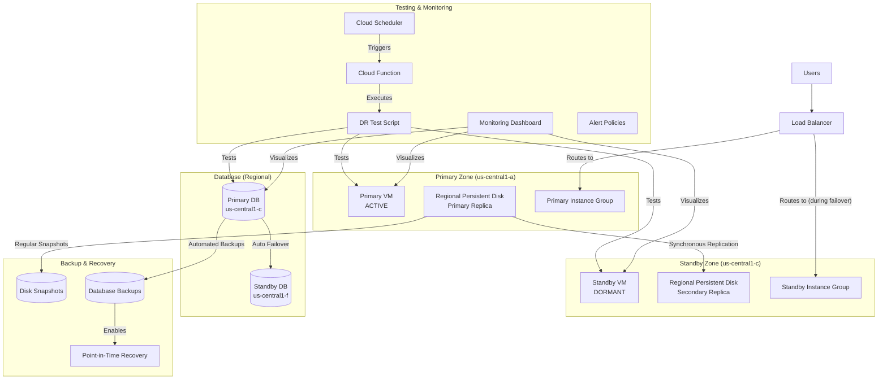

# Architecture Diagram Instructions

The architecture diagram for the DR solution is defined in the README.md file using Mermaid syntax. To generate the diagram:

## Option 1: Using Mermaid Live Editor

1. Copy the Mermaid code from the README.md file:

2. Go to [Mermaid Live Editor](https://mermaid.live/)
3. Paste the code into the editor
4. Click "Download SVG" or "Download PNG" to save the diagram
5. Place the downloaded file in the `dr_active_passive_complete_zonal` directory with the name `architecture_diagram.png`

## Option 2: Using GitHub Markdown

If you're using GitHub, the Mermaid diagram will render automatically in the README.md file when viewed on GitHub.

## Option 3: Using VS Code Extension

1. Install the "Markdown Preview Mermaid Support" extension for VS Code
2. Open the README.md file
3. Right-click and select "Open Preview"
4. The diagram will render in the preview
5. Right-click on the diagram and select "Save as image"
6. Save the image as `architecture_diagram.png` in the `dr_active_passive_complete_zonal` directory
