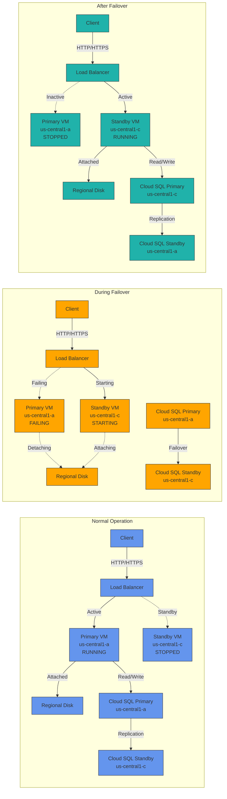

# DR Active-Passive Complete Zonal Implementation

This directory contains the implementation of the DR active-passive complete zonal module, which provides a comprehensive disaster recovery solution using Google Cloud's native services.

## Architecture

```mermaid
graph LR
    Client[Client] -->|HTTPS:443| HTTPSFR[HTTPS Forwarding Rule]
    Client -->|HTTP:80| HTTPFR[HTTP Forwarding Rule]
    
    HTTPSFR --> HTTPSProxy[HTTPS Proxy]
    HTTPFR --> HTTPProxy[HTTP Proxy]
    
    HTTPSProxy -->|SSL Termination| SSLCert[SSL Certificate]
    SSLCert --> URLMap[URL Map]
    HTTPProxy --> URLMap
    
    URLMap --> BackendService[Backend Service<br>port_name: http8080]
    BackendService --> HC[Health Check<br>port: 8080<br>path: /web]
    
    BackendService --> PrimaryIG[Primary Instance Group<br>named_port: http8080:8080]
    BackendService --> StandbyIG[Standby Instance Group<br>named_port: http8080:8080]
    
    PrimaryIG --> PrimaryVM[Primary VM<br>app listening on 0.0.0.0:8080]
    StandbyIG --> StandbyVM[Standby VM<br>app listening on 0.0.0.0:8080]
    
    PrimaryVM --> RegionalDisk[Regional Persistent Disk<br>Mounted at /mnt/regional-disk]
    StandbyVM -.-> RegionalDisk
    
    PrimaryVM -->|Read/Write| CloudSQL[Cloud SQL with HA]
    StandbyVM -.->|Failover Only| CloudSQL
    
    classDef https fill:#32CD32,stroke:#333,stroke-width:1px;
    classDef http fill:#FFD700,stroke:#333,stroke-width:1px;
    classDef shared fill:#4682B4,stroke:#333,stroke-width:1px;
    classDef primary fill:#6495ED,stroke:#333,stroke-width:1px;
    classDef standby fill:#20B2AA,stroke:#333,stroke-width:1px;
    classDef storage fill:#FF6347,stroke:#333,stroke-width:1px;
    
    class HTTPSFR,HTTPSProxy,SSLCert https;
    class HTTPFR,HTTPProxy http;
    class URLMap,BackendService,HC shared;
    class PrimaryIG,PrimaryVM primary;
    class StandbyIG,StandbyVM standby;
    class RegionalDisk,CloudSQL storage;
```



### Failover Scenarios



The architecture includes:

- **Primary VM** in the primary zone (us-central1-a)
- **Standby VM** in the standby zone (us-central1-c)
- **Regional Persistent Disk** for synchronous replication between zones
- **Cloud SQL with HA** for database high availability with binary logging for point-in-time recovery
- **Global Load Balancer** with both HTTP and HTTPS support
  - SSL termination at the load balancer level
  - Self-signed certificates for HTTPS
- **Backup and Recovery** capabilities
- **Monitoring and Alerting** with a hybrid approach

## Disk Replication Demonstration

This implementation demonstrates two different replication methods:

1. **Synchronous Replication** using a regional persistent disk
   - Data is written to both zones simultaneously
   - Zero RPO (Recovery Point Objective)
   - Immediate availability during failover
   - Files are stored in `/mnt/regional-disk/`

2. **Snapshot-based Replication** for the root disk
   - Data is backed up periodically via snapshots
   - Non-zero RPO (depends on snapshot frequency)
   - Requires restoration during failover
   - Files are stored in the application directory

The web interface displays data from both disks to clearly show the difference in replication methods during failover testing.

## SSL/TLS Support

The solution includes HTTPS support with the following features:

- **SSL Termination at Load Balancer**: All SSL/TLS processing happens at the load balancer level, reducing computational load on application servers
- **Self-Signed Certificates**: The implementation uses self-signed certificates for HTTPS
- **Certificate Generation**: A script (`generate_certs.sh`) is provided to generate self-signed certificates
- **Dual Protocol Support**: Both HTTP and HTTPS endpoints are available

To regenerate certificates:
```bash
cd dr_active_passive_complete_zonal
./generate_certs.sh
terraform apply
```

For production use, consider replacing self-signed certificates with certificates from a trusted Certificate Authority.

## Setup Instructions

### Prerequisites

- Google Cloud project with billing enabled
- Terraform installed
- gcloud CLI configured
- Required Google Cloud APIs enabled (see [PREREQUISITES.md](PREREQUISITES.md))
- Service account with necessary permissions (see [PREREQUISITES.md](PREREQUISITES.md))

You can use the provided script to set up all prerequisites:
```bash
# Complete script to set up all prerequisites
./setup_dr_prerequisites.sh your-project-id
```

### Deployment Steps

1. **Initialize Terraform**:
   ```bash
   cd dr_active_passive_complete_zonal
   terraform init
   ```

2. **Configure Variables**:
   Edit `terraform.tfvars` with your specific values:
   ```hcl
   project_id = "your-project-id"
   region = "us-central1"
   primary_zone = "us-central1-a"
   standby_zone = "us-central1-c"
   notification_email = "your-email@example.com"
   db_password = "your-secure-password"
   ```

3. **Deploy the Infrastructure**:
   ```bash
   terraform apply
   ```

4. **Verify Deployment**:
   ```bash
   # Check status
   ./dr_demo_test.sh status
   
   # Access the application via HTTP
   curl http://$(terraform output -raw load_balancer_http_ip)/web
   
   # Access the application via HTTPS (ignore certificate warnings)
   curl -k https://$(terraform output -raw load_balancer_https_ip)/web
   ```

## Testing the DR Solution

### On-Demand Testing

Use the `dr_demo_test.sh` script for on-demand testing:

```bash
# Check current status
./dr_demo_test.sh status

# Test failover
./dr_demo_test.sh failover

# Test failback
./dr_demo_test.sh failback

# Create backups
./dr_demo_test.sh backup

# Test disk restore
./dr_demo_test.sh restore-disk

# Test database point-in-time recovery
./dr_demo_test.sh restore-db

# Run complete DR test
./dr_demo_test.sh test-all
```

### Scheduled Testing

The solution includes automated scheduled tests:

1. **Weekly Status Check**: Runs every Monday at 8 AM
2. **Monthly Backup Test**: Runs on the 1st of each month at 2 AM
3. **Quarterly Failover Test**: Runs on the 1st of every 3rd month at 1 AM (requires approval)

Test results are stored in Cloud Storage and notifications are sent via email.

## Monitoring

### Default GCP Dashboards

Access the default GCP dashboards for comprehensive metrics:

1. **VM Instances Dashboard**:
   - Go to Google Cloud Console > Compute Engine > VM Instances
   - Click on the VM name > Monitoring tab

2. **Cloud SQL Dashboard**:
   - Go to Google Cloud Console > SQL > Instance
   - Click on the instance name > Monitoring tab

3. **Load Balancer Dashboard**:
   - Go to Google Cloud Console > Network Services > Load Balancing
   - Click on the load balancer name > Monitoring tab

### Custom DR Dashboard

Access the custom DR dashboard for focused DR metrics:

1. Go to Google Cloud Console > Monitoring > Dashboards
2. Look for "DR Health Dashboard" in the list
3. Or use the direct URL from the Terraform output:
   ```bash
   terraform output dashboard_url
   ```

## Demo Steps

### Basic Demo (15 minutes)

1. **Introduction** (2 minutes):
   - Explain the DR architecture using the diagram
   - Highlight key components and their roles

2. **Status Check** (2 minutes):
   ```bash
   ./dr_demo_test.sh status
   ```
   - Show the current state of primary and standby resources
   - Explain the active-passive setup
   - Demonstrate both HTTP and HTTPS access:
     ```bash
     # HTTP access
     curl http://$(terraform output -raw load_balancer_http_ip)/web
     
     # HTTPS access
     curl -k https://$(terraform output -raw load_balancer_https_ip)/web
     ```

3. **Failover Demo** (5 minutes):
   ```bash
   ./dr_demo_test.sh failover
   ```
   - Explain each step as it happens
   - Show the application running in the standby zone
   - Highlight the automatic database failover

4. **Failback Demo** (5 minutes):
   ```bash
   ./dr_demo_test.sh failback
   ```
   - Explain the failback process
   - Show the application running in the primary zone again
   - Discuss RTO and RPO achieved

5. **Q&A** (1 minute)

### Comprehensive Demo (30 minutes)

1. **Introduction** (3 minutes)
2. **Status Check** (2 minutes)
3. **Failover Demo** (5 minutes)
4. **Backup Creation** (3 minutes):
   ```bash
   ./dr_demo_test.sh backup
   ```

5. **Disk Restore Demo** (7 minutes):
   ```bash
   ./dr_demo_test.sh restore-disk
   ```
   - Show how to restore data from a snapshot
   - Verify the restored data

6. **Database Point-in-Time Recovery** (7 minutes):
   ```bash
   ./dr_demo_test.sh restore-db
   ```
   - Demonstrate recovering to a specific point in time
   - Verify the data consistency

7. **Failback Demo** (3 minutes)
8. **Q&A** (5 minutes)

## Cleanup

To destroy the infrastructure when no longer needed:

```bash
terraform destroy
```

## Additional Resources

- [Google Cloud Disaster Recovery Planning Guide](https://cloud.google.com/architecture/dr-scenarios-planning-guide)
- [Cloud SQL High Availability](https://cloud.google.com/sql/docs/mysql/high-availability)
- [Regional Persistent Disks](https://cloud.google.com/compute/docs/disks/regional-persistent-disk)
- [Module Documentation](../modules/dr_active_passive_complete_zonal/README.md)
