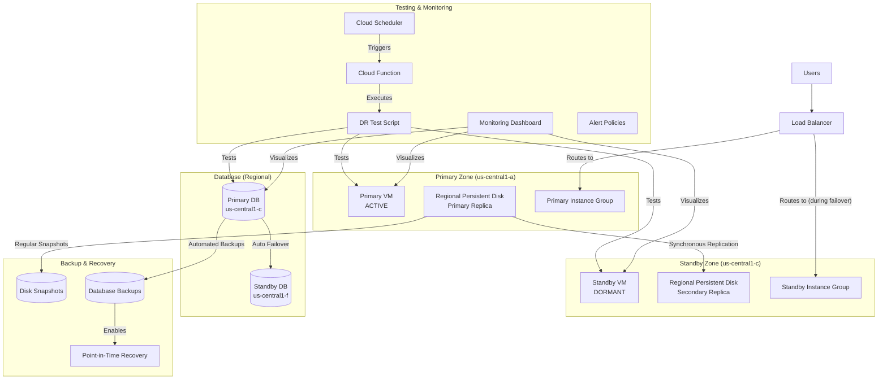

# Active-Passive Complete Zonal DR Solution

This module implements a comprehensive disaster recovery (DR) solution using Google Cloud's native services. It provides an active-passive zonal DR architecture with complete backup and point-in-time recovery capabilities.

## Architecture



## Key Components

### 1. Compute Resources
- **Primary VM**: Active VM in the primary zone (us-central1-a)
- **Standby VM**: Dormant VM in the standby zone (us-central1-c)
- **Regional Persistent Disk**: Synchronously replicates data between zones

### 2. Database Resources
- **Cloud SQL with HA**: Primary instance with standby replica in different zone
- **Automated Backups**: Regular backups with binary logging for point-in-time recovery

### 3. Networking
- **Load Balancer**: Routes traffic to the active instance
- **Health Checks**: Monitors instance health

### 4. Backup & Recovery
- **Disk Snapshots**: Regular snapshots of persistent disks
- **Database Backups**: Automated backups with point-in-time recovery
- **Backup Retention**: Configurable retention policies

### 5. Monitoring & Alerting
- **Custom Dashboard**: Visualizes DR metrics
- **Alert Policies**: Notifies of potential issues
- **Hybrid Approach**: Leverages both default GCP dashboards and custom metrics
- **Separate Alerts Configuration**: See [MONITORING_ALERTS.md](MONITORING_ALERTS.md) for details on applying alert policies

## Usage

```hcl
module "dr_complete" {
  source = "../modules/dr_active_passive_complete_zonal"
  
  project_id        = "your-project-id"
  region            = "us-central1"
  primary_zone      = "us-central1-a"
  standby_zone      = "us-central1-c"
  
  vm_machine_type   = "e2-medium"
  disk_size_gb      = 50
  
  db_name           = "app_database"
  db_user           = "app_user"
  db_password       = var.db_password
  
  notification_email = "alerts@example.com"
  setup_script_path  = "../setup.sh"
}
```

## Testing

The module includes both scheduled and on-demand testing capabilities:

### Scheduled Testing
- **Weekly Status Check**: Runs every Monday at 8 AM
- **Monthly Backup Test**: Runs on the 1st of each month at 2 AM
- **Quarterly Failover Test**: Runs on the 1st of every 3rd month at 1 AM (requires approval)

### On-Demand Testing
Use the `dr_demo_test.sh` script for on-demand testing:

```bash
# Check current status
./dr_demo_test.sh status

# Test failover
./dr_demo_test.sh failover

# Test failback
./dr_demo_test.sh failback

# Create backups
./dr_demo_test.sh backup

# Test disk restore
./dr_demo_test.sh restore-disk

# Test database point-in-time recovery
./dr_demo_test.sh restore-db

# Run complete DR test
./dr_demo_test.sh test-all
```

## Monitoring

The module uses a hybrid monitoring approach:

### Default GCP Dashboards
- VM Instances Dashboard
- Cloud SQL Dashboard
- Load Balancer Dashboard
- Persistent Disk Dashboard

### Custom DR Dashboard
A custom dashboard is created with the following widgets:
- Primary VM Status
- Standby VM Status
- Database Replication Lag
- DR Test Results
- Recovery Time

### Alert Policies
The module includes several alert policies:
- VM uptime alerts
- Database uptime alerts
- Database replication lag alerts
- Application error alerts (applied separately - see [MONITORING_ALERTS.md](MONITORING_ALERTS.md))

**Note**: Due to Google Cloud's limitations with custom metrics, some alert policies need to be applied separately after the main deployment. See [MONITORING_ALERTS.md](MONITORING_ALERTS.md) for detailed instructions.

## Inputs

| Name | Description | Type | Default | Required |
|------|-------------|------|---------|:--------:|
| project_id | GCP project ID | string | n/a | yes |
| region | Region for regional resources | string | "us-central1" | no |
| primary_zone | Primary zone for zonal resources | string | "us-central1-a" | no |
| standby_zone | Standby zone for zonal resources | string | "us-central1-c" | no |
| vm_machine_type | Machine type for VMs | string | "e2-medium" | no |
| vm_image | Image for VM boot disks | string | "debian-cloud/debian-11" | no |
| disk_size_gb | Size of the regional disk in GB | number | 20 | no |
| boot_disk_size_gb | Size of the boot disk in GB | number | 10 | no |
| setup_script_path | Path to the setup script | string | "../setup.sh" | no |
| go_version | Version of Go to install | string | "1.24.1" | no |
| db_tier | Machine tier for Cloud SQL | string | "db-g1-small" | no |
| db_name | Database name | string | "app_database" | no |
| db_user | Database username | string | "app_user" | no |
| db_password | Database password | string | n/a | yes |
| backup_start_time | Start time for database backups (24h format) | string | "02:00" | no |
| transaction_log_retention_days | Number of days to retain transaction logs | number | 7 | no |
| retained_backups | Number of database backups to retain | number | 7 | no |
| deletion_protection | Enable deletion protection for the database | bool | false | no |
| maintenance_day | Day of week for maintenance window (1-7) | number | 7 | no |
| maintenance_hour | Hour of day for maintenance window (0-23) | number | 2 | no |
| notification_email | Email address for notifications | string | "admin@example.com" | no |
| error_threshold | Number of errors that trigger an alert | number | 5 | no |
| replication_lag_threshold_ms | Database replication lag threshold in milliseconds | number | 60000 | no |

## Outputs

| Name | Description |
|------|-------------|
| primary_vm_name | Name of the primary VM |
| primary_vm_zone | Zone of the primary VM |
| primary_vm_ip | External IP of the primary VM |
| standby_vm_name | Name of the standby VM |
| standby_vm_zone | Zone of the standby VM |
| standby_vm_ip | External IP of the standby VM |
| database_name | Name of the Cloud SQL instance |
| database_connection_name | Connection name of the Cloud SQL instance |
| database_ip | IP address of the Cloud SQL instance |
| load_balancer_ip | IP address of the load balancer |
| app_url | URL of the application |
| backup_bucket_name | Name of the backup storage bucket |
| snapshot_schedule_name | Name of the snapshot schedule |
| dashboard_url | URL to the monitoring dashboard |
| service_account_email | Email of the service account |
| test_schedule_weekly | Schedule for weekly DR tests |
| test_schedule_monthly | Schedule for monthly DR tests |
| test_schedule_quarterly | Schedule for quarterly DR tests |

## Recovery Metrics

| Metric | Target | Description |
|--------|--------|-------------|
| RTO (Recovery Time Objective) | < 15 minutes | Time to restore service |
| RPO (Recovery Point Objective) | 0 for disk, < 1 hour for VM | Potential data loss window |
| Failover Success Rate | > 99% | Percentage of successful failovers |
| Backup Success Rate | > 99.9% | Percentage of successful backups |

## Limitations

- This solution provides zonal DR within a single region
- For multi-region DR, additional components would be needed
- The standby VM is stopped by default to reduce costs
- Manual approval is required for scheduled failover tests
